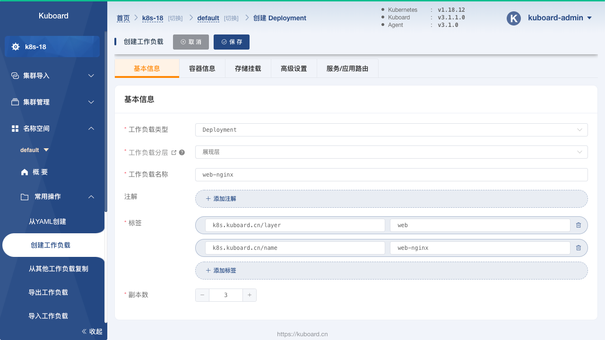
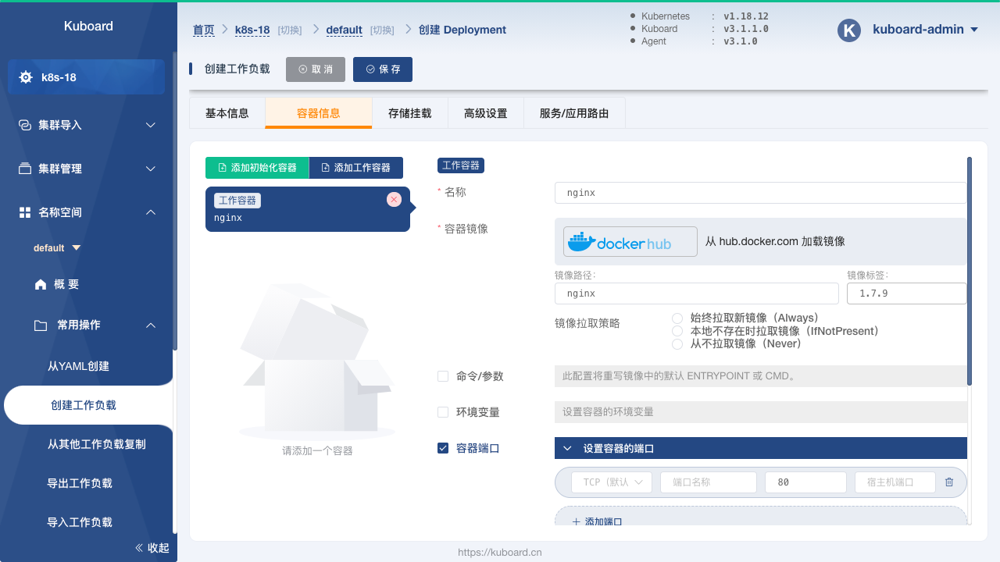
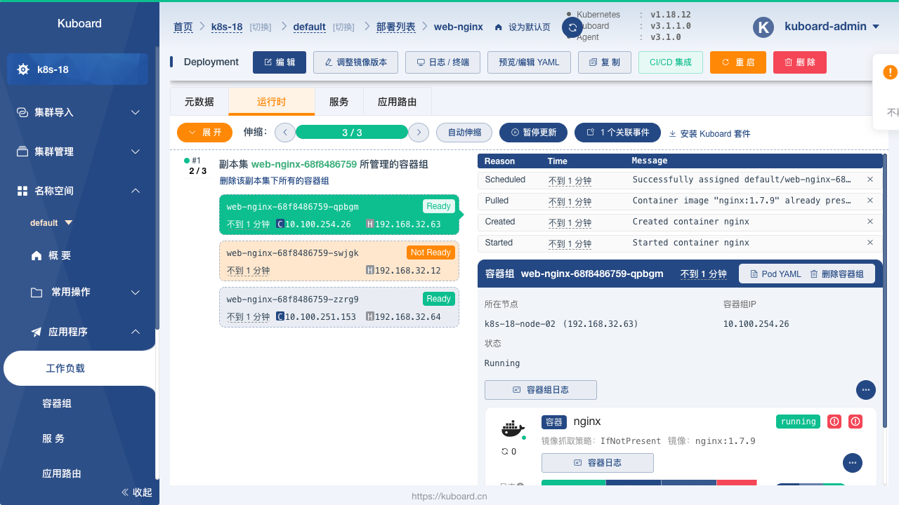

# 创建 Deployment

<AdSenseTitle/>

[返回 Deployment](./#deployment-概述)

本文描述了如何创建一个 Deployment，如何理解 Deployment 各个字段，以及如何查看 Deployment 的创建结果。

> 本文同时讲述了两种创建 Deployment 的方式：
> * 使用 kubectl 创建 Deployment
> * 使用 Kuboard 创建 Deployment

<b-card>
<b-tabs content-class="mt-3">
<b-tab title="使用 kubectl 创建 Deployment">

下面的 yaml 文件定义了一个 Deployment，该 Deployment 将创建一个有 3 个 nginx Pod 副本的 ReplicaSet（副本集）：

``` yaml
apiVersion: apps/v1
kind: Deployment
metadata:
  name: nginx-deployment
  labels:
    app: nginx
spec:
  replicas: 3
  selector:
    matchLabels:
      app: nginx
  template:
    metadata:
      labels:
        app: nginx
    spec:
      containers:
      - name: nginx
        image: nginx:1.7.9
        ports:
        - containerPort: 80
```

**在这个例子中：**

* 将创建一个名为 nginx-deployment 的 Deployment（部署），名称由 `.metadata.name` 字段指定
* 该 Deployment 将创建 3 个 Pod 副本，副本数量由 `.spec.replicas` 字段指定
* `.spec.selector` 字段指定了 Deployment 如何找到由它管理的 Pod。此案例中，我们使用了 Pod template 中定义的一个标签（app: nginx）。对于极少数的情况，这个字段也可以定义更加复杂的规则
* `.template` 字段包含了如下字段：
  * `.template.metadata.labels` 字段，指定了 Pod 的标签（app: nginx）
  * `.template.spec.containers[].image` 字段，表明该 Pod 运行一个容器 `nginx:1.7.9`
  * `.template.spec.containers[].name` 字段，表明该容器的名字是 `nginx`

**按照下面的步骤创建该 Deployment**

1. 执行命令以创建 Deployment
  ``` sh
  kubectl apply -f https://k8s.io/examples/controllers/nginx-deployment.yaml
  ```
  ::: tip
  您可以为该命令增加 --record 选项，此时 kubectl 会将 `kubectl apply -f https://k8s.io/examples/controllers/nginx-deployment.yaml --record` 写入 Deployment 的 annotation（注解） `kubernetes.io/change-cause` 中。这样，您在将来就可以回顾某一个 Deployment 版本变化的原因
  :::

2. 执行命令 `kubectl get deployments` 检查 Deployment 的创建情况。如果该 Deployment仍在创建过程中，输出结果如下所示：

  ``` sh
  NAME               DESIRED   CURRENT   UP-TO-DATE   AVAILABLE   AGE
  nginx-deployment   3         0         0            0           1s
  ```
  **字段含义**

  | 字段名称       | 说明                                                         |
  | -------------- | ------------------------------------------------------------ |
  | **NAME**       | Deployment name                                              |
  | **DESIRED**    | Deployment 期望的 Pod 副本数，即 Deployment 中 `.spec.replicas` 字段指定的数值。该数值是“期望”值 |
  | **CURRENT**    | 当前有多少个 Pod 副本数在运行                                |
  | **UP-TO-DATE** | Deployment 中，符合当前 Pod Template 定义的 Pod 数量 |
  | **AVAILABLE**  | 当前对用户可用的 Pod 副本数                                  |
  | **AGE**        | Deployment 部署以来到现在的时长                              |

3. 查看 Deployment 的发布状态（rollout status），执行命令 `kubectl rollout status deployment.v1.apps/nginx-deployment`。输出结果树下所示：

  ```sh
  Waiting for rollout to finish: 2 out of 3 new replicas have been updated...
  deployment.apps/nginx-deployment successfully rolled out
  ```

4. 等待几秒后，再次执行命令 `kubectl get deployments`，输出结果如下所示：

  ```sh
  NAME               DESIRED   CURRENT   UP-TO-DATE   AVAILABLE   AGE
  nginx-deployment   3         3         3            3           18s
  ```
  此时该 Deployment 已经完成了 3 个 Pod 副本的创建，并且所有的副本都是 UP-TO-DATE（符合最新的 Pod template 定义） 和 AVAILABEL

5. 查看该 Deployment 创建的 ReplicaSet（rs），执行命令 `kubectl get rs`，输出结果如下所示：

  ``` sh
  NAME                          DESIRED   CURRENT   READY   AGE
  nginx-deployment-75675f5897   3         3         3       18s
  ```

6. 查看 Pod 的标签，执行命令 `kubectl get pods --show-labels`，输出结果如下所示：

  ```sh
  NAME                                READY     STATUS    RESTARTS   AGE       LABELS
  nginx-deployment-75675f5897-7ci7o   1/1       Running   0          18s       app=nginx,pod-template-hash=3123191453
  nginx-deployment-75675f5897-kzszj   1/1       Running   0          18s       app=nginx,pod-template-hash=3123191453
  nginx-deployment-75675f5897-qqcnn   1/1       Running   0          18s       app=nginx,pod-template-hash=3123191453
  ```

  Deployment 创建的 ReplicaSet（副本集）确保集群中有 3 个 nginx Pod。

  ::: tip
  您必须为 Deployment 中的 `.spec.selector` 和 `.template.metadata.labels` 定义一个合适的标签（这个例子中的标签是 app: nginx）。请不要使用与任何其他控制器（其他 Deployment / StatefulSet 等）相同的 `.spec.selector` 和 `.template.metadata.labels`。否则可能发生冲突，并产生不可预见的行为。
  :::


**Pod-template-hash 标签**

::: danger 警告

请不要修改这个标签

:::

pod-template-hash 标签是 Deployment 创建 ReplicaSet 时添加到 ReplicaSet 上的，ReplicaSet 进而将此标签添加到 Pod 上。这个标签用于区分 Deployment 中哪个 ReplicaSet 创建了哪些 Pod。该标签的值是 `.spec.template` 的 hash 值。

</b-tab>
<b-tab title="使用 Kuboard 创建 Deployment" active>


1. 进入 Kuboard 名称空间页面，点击左侧菜单中的 ***创建工作负载*** 按钮；

   

   并填写如下表单：

   | 区域              | 字段名称 | 填写内容     | 字段说明                                                     |
   | ----------------- | -------- | ------------ | ------------------------------------------------------------ |
   | 基本信息          | 服务类型 | Deployment   |                                                              |
   |                   | 服务分层 | 展现层       | Kuboard 特性的字段，用于表示该工作复杂显示在名称空间的哪一个分层 |
   |                   | 服务名称 | web-nginx    |                                                              |
   |                   | 副本数量 | 3            |                                                              |

   

2. 切换到 ***容器信息*** Tab 页，如下图所示：

    

    并填写如下表单：

    | 区域                    | 字段名称 | 填写内容     | 字段说明         |
    | ----------------------- | -------- | ------------ | ---------------- |
    | 容器信息-->添加工作容器 | 容器名称 | nginx        |                  |
    |                         | 镜像     | nginx:1.7.9  |                  |
    |                         | Ports    | TCP   :   80 | 容器组暴露的端口 |

3. 点击保存后，可以看到 Deployment 的更新界面，如下图所示：

     

   Kuboard 在界面中显示了 ReplicaSets、Pods 的动态变化过程。

   

4. 对于每一个 Pod，Kuboard 提供了如下几个功能可以便捷的与容器内应用进行交互：

   代理：替代 kubectl proxy 功能，可以直接访问容器内应用，参考 [KuboardProxy](/guide/proxy)

   日志：替代 kubectl logs 功能，可以直接追踪容器内应用的日志输出；

   bash/sh：替代 kubectl exec 功能，可以直接进入容器内应用的终端；

</b-tab>
</b-tabs>
</b-card>


[返回 Deployment](./#deployment-概述)
