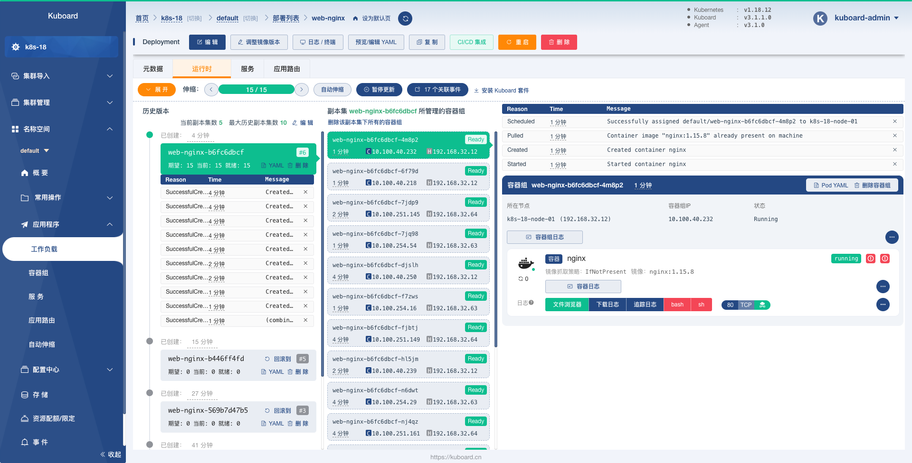

# 查看 Deployment 的状态

<AdSenseTitle/>

[返回 Deployment](./#deployment-概述)

Deployment 的生命周期中，将会进入不同的状态，这些状态可能是：
* Progressing 正在执行滚动更新
* complete
* fail to progress

<b-card>
<b-tabs content-class="mt-3">
<b-tab title="使用 kubectl 查看 Deployment 状态">

<h2>Progressing 状态</h2>

当如下任何一个任务正在执行时，Kubernete 将 Deployment 的状态标记为 ***progressing***：
* Deployment 创建了一个新的 ReplicaSet
* Deployment 正在 scale up 其最新的 ReplicaSet
* Deployment 正在 scale down 其旧的 ReplicaSet
* 新的 Pod 变为 ***就绪（ready）*** 或 ***可用（available）***

您可以使用命令 `kubectl rollout status` 监控 Deployment 滚动更新的过程

<h2>Complete 状态</h2>

如果 Deployment 符合以下条件，Kubernetes 将其状态标记为 ***complete***：
* 该 Deployment 中的所有 Pod 副本都已经被更新到指定的最新版本
* 该 Deployment 中的所有 Pod 副本都处于 ***可用（available）*** 状态
* 该 Deployment 中没有旧的 ReplicaSet 正在运行

您可以执行命令 `kubectl rollout status` 检查 Deployment 是否已经处于 ***complete*** 状态。如果是，则该命令的退出码为 0。
例如，执行命令 `kubectl rollout status deployment.v1.apps/nginx-deployment`，输出结果如下所示：

``` sh
Waiting for rollout to finish: 2 of 3 updated replicas are available...
deployment.apps/nginx-deployment successfully rolled out
$ echo $?
0
```

<h2>Failed 状态</h2>

Deployment 在更新其最新的 ReplicaSet 时，可能卡住而不能达到 ***complete*** 状态。如下原因都可能导致此现象发生：
* 集群资源不够
* 就绪检查（readiness probe）失败
* 镜像抓取失败
* 权限不够
* 资源限制
* 应用程序的配置错误导致启动失败

指定 Deployment 定义中的 `.spec.progressDeadlineSeconds` 字段，Deployment Controller 在等待指定的时长后，将 Deployment 的标记为处理失败。例如，执行命令 `kubectl patch deployment.v1.apps/nginx-deployment -p '{"spec":{"progressDeadlineSeconds":600}}'` 使得 Deployment Controller 为 Deployment 的处理过程等候 10 分钟，输出结果如下所示：

```
deployment.apps/nginx-deployment patched
```

等候时间达到后，Deployment Controller 将在 Deployment 的 `.status.conditions` 字段添加如下 `DeploymentCondition`：
* Type=Progressing
* Status=False
* Reason=ProgressDeadlineExceeded

::: tip
* 除了添加一个 `Reason=ProgressDeadlineExceeded` 的 `DeploymentCondition` 到 `.status.conditions` 字段以外，Kubernetes 不会对被卡住的 Deployment 做任何操作。您可以执行 `kubectl rollout undo` 命令，将 Deployment 回滚到上一个版本
* 如果您暂停了 Deployment，Kubernetes 将不会检查 `.spec.progressDeadlineSeconds`。
:::

如果您设定的 `.spec.progressDeadlinSeconds` 太短了，或者其他原因，您可能发现 Deployment 的状态改变出错。例如，假设您的集群缺乏足够的资源，执行命令 `kubectl describe deployment nginx-deployment`，输出结果如下所示：

```
<...>
Conditions:
  Type            Status  Reason
  ----            ------  ------
  Available       True    MinimumReplicasAvailable
  Progressing     True    ReplicaSetUpdated
  ReplicaFailure  True    FailedCreate
<...>
```

执行命令 `kubectl get deployment nginx-deployment -o yaml`，Deployment 的 Status 结果如下所示：
```
status:
  availableReplicas: 2
  conditions:
  - lastTransitionTime: 2016-10-04T12:25:39Z
    lastUpdateTime: 2016-10-04T12:25:39Z
    message: Replica set "nginx-deployment-4262182780" is progressing.
    reason: ReplicaSetUpdated
    status: "True"
    type: Progressing
  - lastTransitionTime: 2016-10-04T12:25:42Z
    lastUpdateTime: 2016-10-04T12:25:42Z
    message: Deployment has minimum availability.
    reason: MinimumReplicasAvailable
    status: "True"
    type: Available
  - lastTransitionTime: 2016-10-04T12:25:39Z
    lastUpdateTime: 2016-10-04T12:25:39Z
    message: 'Error creating: pods "nginx-deployment-4262182780-" is forbidden: exceeded quota:
      object-counts, requested: pods=1, used: pods=3, limited: pods=2'
    reason: FailedCreate
    status: "True"
    type: ReplicaFailure
  observedGeneration: 3
  replicas: 2
  unavailableReplicas: 2
```

最终，一旦 Deployment 的 `.spec.progressDeadlinSeconds` 超时，Kubernetes 将更新 Deployment 的 Processing condition 如下：

```
Conditions:
  Type            Status  Reason
  ----            ------  ------
  Available       True    MinimumReplicasAvailable
  Progressing     False   ProgressDeadlineExceeded
  ReplicaFailure  True    FailedCreate
```

为了解决资源不足的问题，您可以尝试：
* scale down 您的 Deployment
* scale down 其他的 Deployment
* 向集群中添加计算节点

如果资源足够，并且 Deployment 完成了其滚动更新，您将看到 Deployment 中出现一个成功的 condition（status=True 且 Reason=NewReplicaSetAvailable）。
```
Conditions:
  Type          Status  Reason
  ----          ------  ------
  Available     True    MinimumReplicasAvailable
  Progressing   True    NewReplicaSetAvailable
```

* `Type=Available` 及 `Status=True` 代表您的 Deployment 具备最小可用的 Pod 数（minimum availability）。Minimum availability 由 Deployment 中的 strategy 参数决定。
* `Type=Progressing` 及 `Status=True` 代表您的 Deployment 要么处于滚动更新的过程中，要么已经成功完成更新并且 Pod 数达到了最小可用的数量。

命令 `kubectl rollout status` 可用于检查 Deployment 是否失败，如果该命令的退出码不是 0，则该 Deployment 已经超出了  `.spec.progressDeadlinSeconds` 指定的等候时长。例如，执行命令 `kubectl rollout status deployment.v1.apps/nginx-deployment`，输出结果如下所示：

```
Waiting for rollout to finish: 2 out of 3 new replicas have been updated...
error: deployment "nginx" exceeded its progress deadline
$ echo $?
1
```

<h2>操作处于 Failed 状态的 Deployment</h2>

您可以针对 ***Failed*** 状态下的 Deployment 执行任何适用于 Deployment 的指令，例如：
* scale up / scale down
* 回滚到前一个版本
* 暂停（pause）Deployment，以对 Deployment 的 Pod template 执行多处更新

</b-tab>
<b-tab title="使用 Kuboard 查看 Deployment 状态" active>

在前面的处理中，您已经熟悉了 Kuboard 界面中如何管理 Deployment 的滚动更新过程。此外，还有少许 Deployment 的状态信息显示在运行时信息这个区块，如下图所示：

> 您也可以直接查看 Deployment 的 YAML 内容。




</b-tab>
</b-tabs>
</b-card>

[返回 Deployment](./#deployment-概述)
