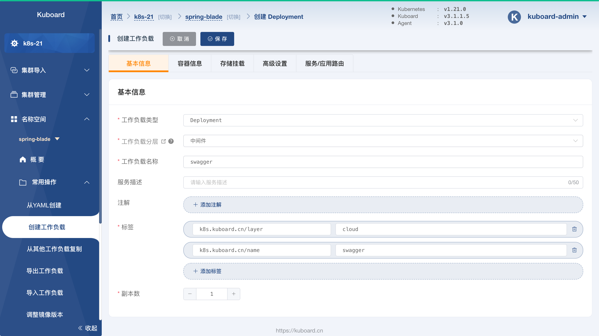
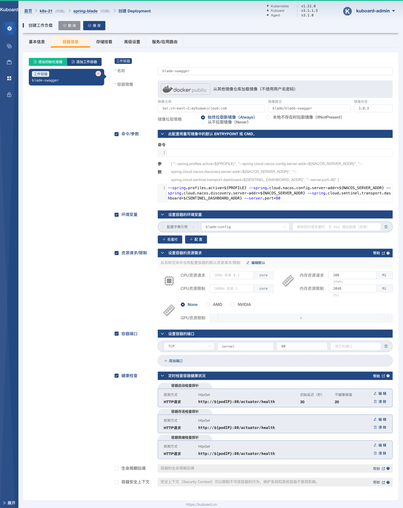
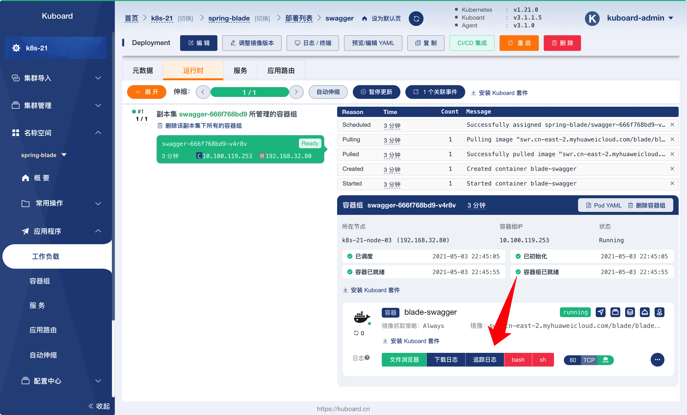
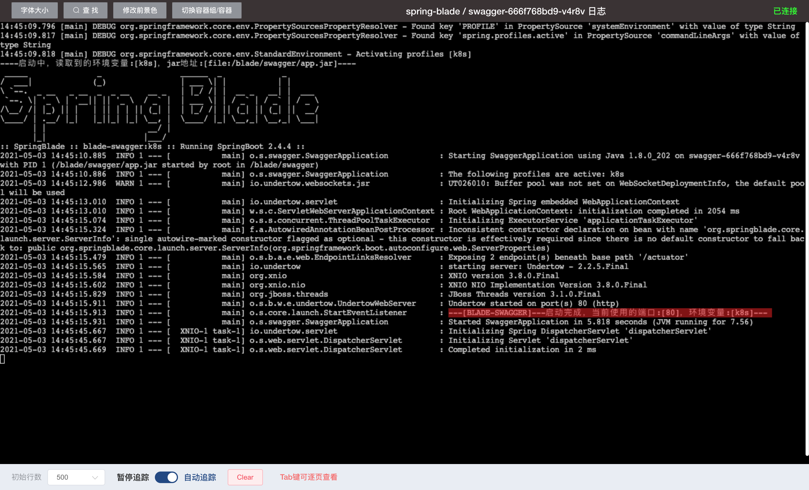

# 部署 swagger

<AdSenseTitle/>

::: tip 前提条件

部署 swagger 之前，请确保：
* 您的环境已经满足 [环境准备](../prepare/prepare.html) 中的要求
* 已经完成了 [部署 nacos](./nacos.html)
* 已经完成了 [部署接口网关](./gateway.html)

:::


本文将按照如下步骤完成 `swagger` 的创建：

* 创建 Deployment
* 验证部署结果


## 创建 Deployment

按照如下步骤创建 `swagger` Deployment：

* 在 Kuboard 界面进入名称空间 `spring-blade` 之后，点击菜单 ***名称空间*** -> ***spring-blade*** -> ***常用操作*** -> ***创建工作负载*** ，如下图所示：

  并填写表单：

  | 字段名称     | 字段值       | 备注                                         |
  | ------------ | ------------ | -------------------------------------------- |
  | 工作负载类型 | `Deployment` |                                              |
  | 工作负载分层 | `中间件`     | 填写后将自动添加 `k8s.kuboard.cn/layer` 标签 |
  | 工作负载名称 | `swagger`    | 填写后将自动添加 `k8s.kuboard.cn/name` 标签  |
  | 副本数       | `1`          |                                              |

  

  

* 切换到 ***容器信息*** 标签，如下图所示：

  点击左侧的 ***添加工作容器*** 按钮，添加一个工作容器，并填写表单：

  | 字段名称                                  | 字段值                                                       | 备注                                                         |
  | ----------------------------------------- | ------------------------------------------------------------ | ------------------------------------------------------------ |
  | 名称                                      | `swagger`                                                    |                                                              |
  | 容器镜像                                  | `从其他镜像仓库加载镜像（不使用用户名密码）`                 |                                                              |
  | 容器镜像-->镜像仓库                       | `swr.cn-east-2.myhuaweicloud.com`                            |                                                              |
  | 容器镜像-->镜像路径                       | `blade/blade-swagger`                                              |                                                              |
  | 容器镜像-->镜像标签                       | `3.0.3`                                                      |                                                              |
  | 镜像拉取策略                              | `始终拉取新镜像（Always）`                                   |                                                              |
  | 命令参数<div style="width: 120px;"></div> | 参数<div style="width: 450px;"> `--spring.profiles.active=${PROFILE} --spring.cloud.nacos.config.server-addr=${NACOS_SERVER_ADDR} --spring.cloud.nacos.discovery.server-addr=${NACOS_SERVER_ADDR} --spring.cloud.sentinel.transport.dashboard=${SENTINEL_DASHBOARD_ADDR} --server.port=80` </div> | 通过启动参数指定：<li>spring的 profile</li><li>Nacos配置中心地址</li><li>Nacos服务发现地址</li><li>Sentinel地址</li><li>服务端口</li><div style="width: 150px;"></div> |
  | 环境变量                                  | `配置字典引用` `blade-config`                                | 点击 ***+ 配置*** 按钮，可以添加一个配置字典的条目；此配置将 `blade-config` 配置字典中的每一个条目都映射成容器中的一个变量及变量值 |
  | 资源请求/限制                             | 内存资源请求：`200Mi`<br />内存资源限制：`2048Mi`            |                                                              |
  | 容器端口                                  | `server  ` `80`                                              |                                                              |
  | 健康检查-->容器启动检查探针               | 探测方式： `HTTP请求`<br />HTTP请求端口： `80`<br />HTTP请求路径： `/actuator/health`<br />初始延迟：`30`<br />不健康阈值： `20` |                                                              |
  | 健康检查-->容器存活检查探针               | 探测方式： `HTTP请求`<br />HTTP请求端口： `80`<br />HTTP请求路径： `/actuator/health` |                                                              |
  | 健康检查-->容器就绪检查探针               | 探测方式： `HTTP请求`<br />HTTP请求端口： `80`<br />HTTP请求路径： `/actuator/health` |                                                              |
  
  
  


* 点击 ***保存*** 按钮，完成 `swagger` Deployment 的创建


## 验证部署结果

按照下面的步骤，可以验证 `swagger` 是否已经成功启动：

* 在上面的步骤中，完成 Deployment 的保存以后，将会进入该 Deployment 的详情页面，如下图所示：

  


* 点击上图中的 ***追踪日志*** 按钮，可以看到 swagger 的日志信息，如下图所示，日志将提示：

  ```
  ---[BLADE-SWAGGER]---启动完成，当前使用的端口:[80]，环境变量:[k8s]---
  ```

  

* 至此，我们可以认为 swagger 已经部署成功。

  下一步，请 [部署所有的微服务](./blade-svc.html)
